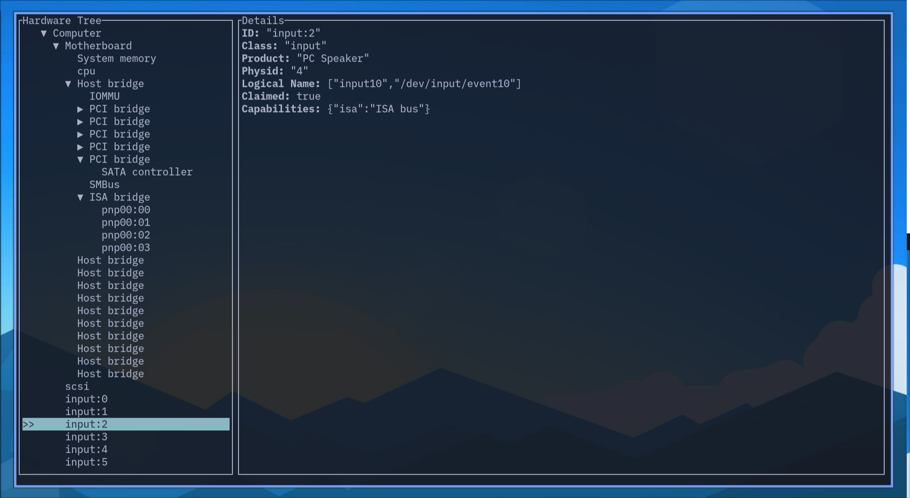

<div align="center">

# lshw-tui

A **lshw-tui** is a simple TUI wrapper for [lshw](https://github.com/lyonel/lshw) to view hardware device tree on your Linux sytem.

</div>

<div align="center">



</div>

## Features

- [x] 💾 View hardware tree quickly
- [x] 🌲 tree-style UI with Vim-like key bindings

## Usage

| Key | Action |
|-----|--------|
| `k` or Up | Up |
| `j` or Down | Down |
| `h` or Left | Close Node |
| `l` or Right | Open Node |
| `q` | Quit |


## Requirements

Requires [lshw](https://github.com/lyonel/lshw), testing on version `B.02.20`.

## Build

```console
cargo build --release
```
